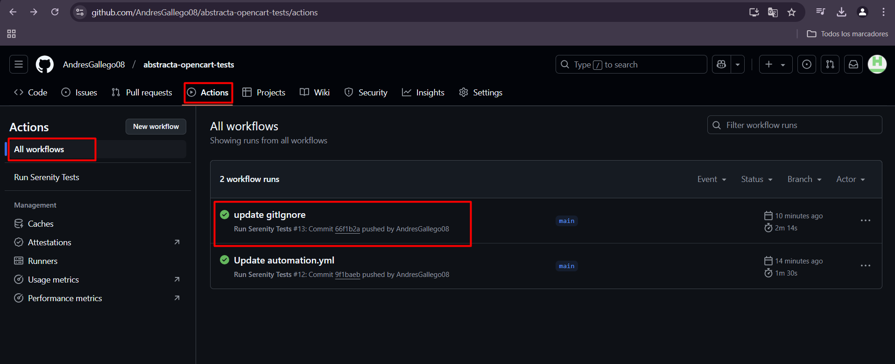
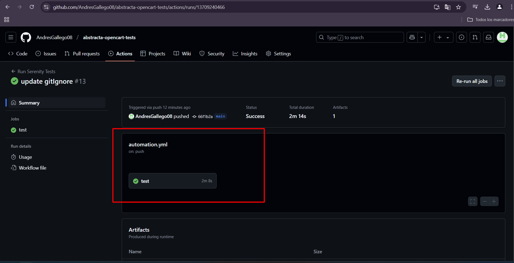
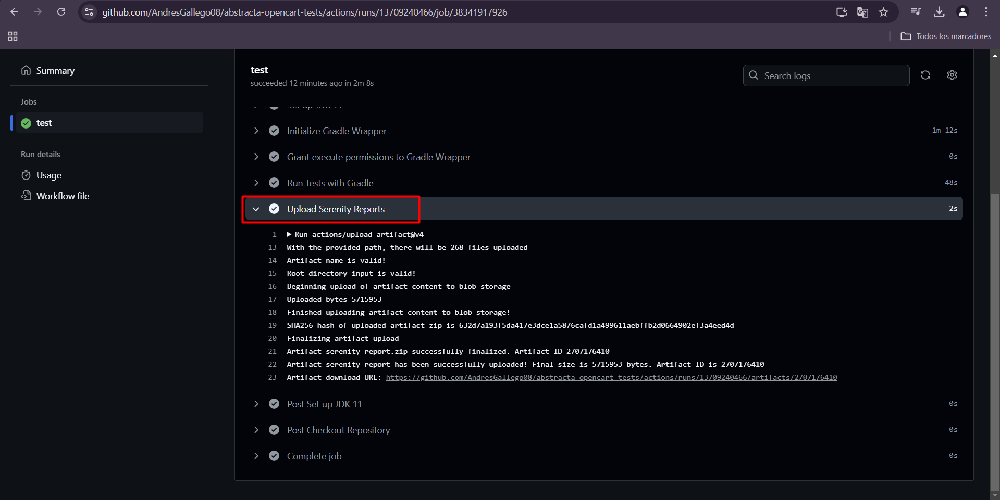
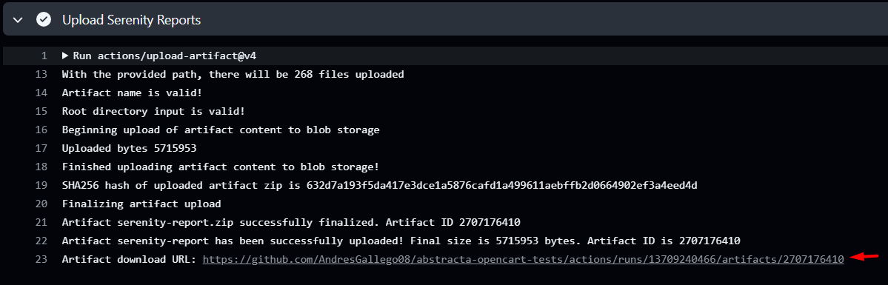
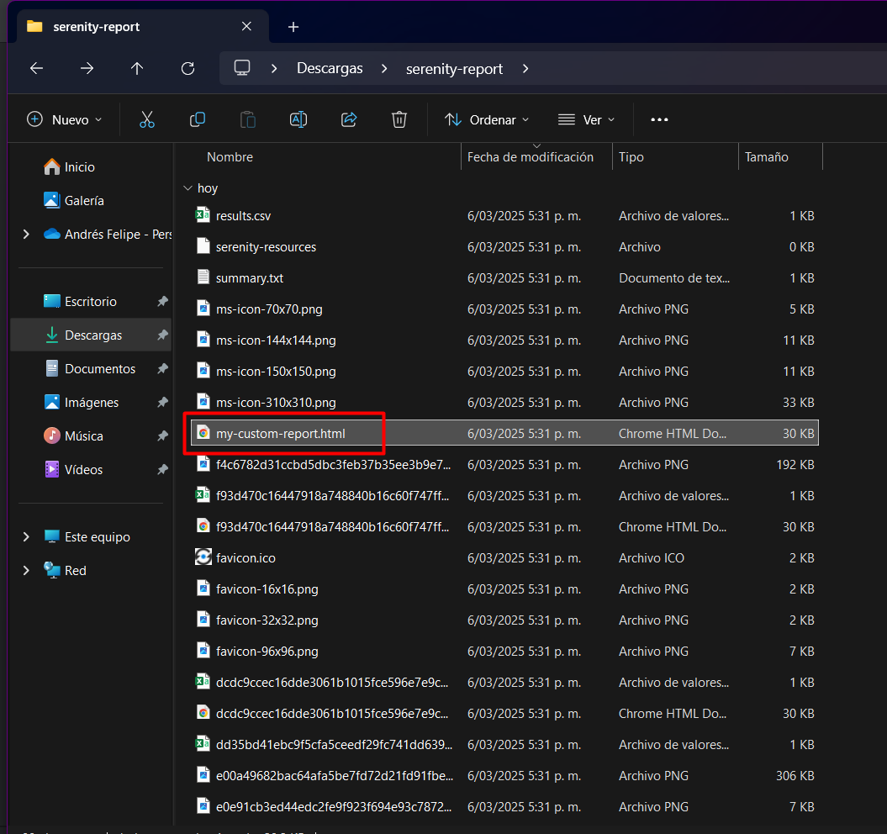
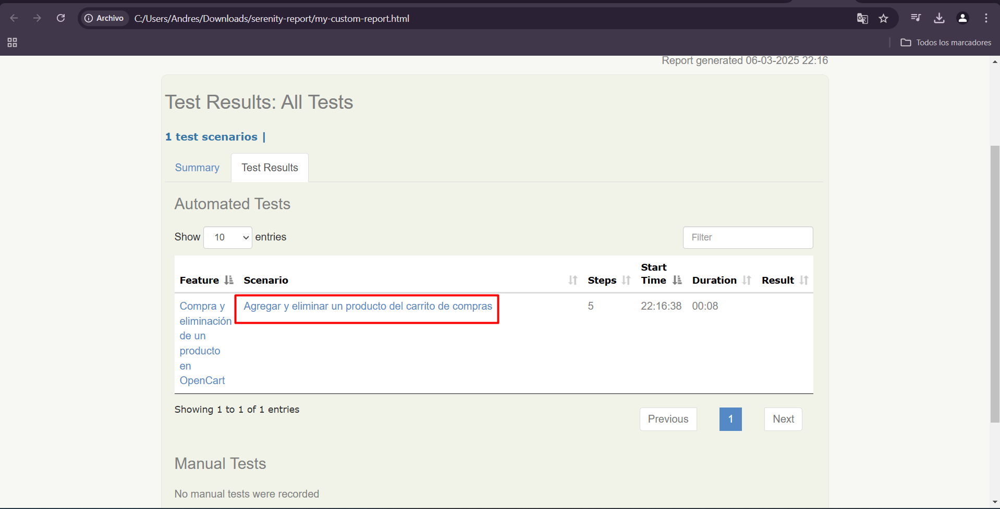
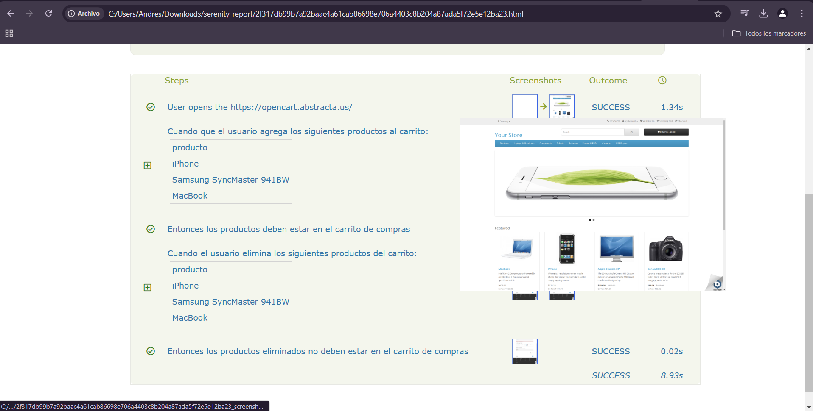

# Proyecto de Automatización OpenCart

Este proyecto de automatización está desarrollado en **Java** utilizando el patrón de diseño **Screenplay** y el framework **Serenity BDD**. Su objetivo es automatizar la compra y eliminación de productos en la tienda en línea OpenCart.

# Repositorio en GitHub

https://github.com/AndresGallego08/abstracta-opencart-tests

## Tecnologías Utilizadas
- **Java:** 11.0.23 LTS
- **Gradle:** 7.5
- **Serenity BDD** con **Screenplay**
- **Cucumber** para definir escenarios en Gherkin
- **WebDriverManager** para la gestión de drivers

## Estructura del Proyecto
```bash
automatizacion-web/
├── src/
│   ├── main/
│   │   ├── java/
│   │   │   ├── com.abstracta.opencart.automation/ 
│   │   │   │   ├── exceptions/        # Manejo de errores y excepciones personalizadas
│   │   │   │   ├── models/            # Representación de datos utilizados en las pruebas
│   │   │   │   ├── questions/         # Validaciones sobre la UI
│   │   │   │   ├── tasks/             # Acciones que un usuario puede realizar
│   │   │   │   ├── userinterfaces/    # Localizadores de elementos en la página web
│   │   │   │   ├── utils/             # Clases auxiliares y configuraciones
│   ├── test/
│   │   ├── java/
│   │   │   ├── com.abstracta.opencart.automation/
│   │   │   │   ├── runners/           # Clases para la ejecución de pruebas con Cucumber
│   │   │   │   ├── stepdefinitions/   # Implementación de los pasos de prueba
│   │   ├── resources/
│   │   │   ├── features/
│   │   │   │   ├── gestion_carrito.feature  # Escenario de prueba
│   │   │   ├── Data_es_ES.properties        # Archivo de propiedades
```

## Escenario de Prueba
El escenario de prueba definido en **Gherkin** es el siguiente:

```gherkin
#language:es

Característica: Compra y eliminación de un producto en OpenCart

  @gestionCarrito
  Escenario: Agregar y eliminar un producto del carrito de compras
    Cuando que el usuario agrega los siguientes productos al carrito:
      | producto                 |
      | iPhone                   |
      | Samsung SyncMaster 941BW |
      | MacBook                  |
    Entonces los productos deben estar en el carrito de compras
    Cuando el usuario elimina los siguientes productos del carrito:
      | producto                 |
      | iPhone                   |
      | Samsung SyncMaster 941BW |
      | MacBook                  |
    Entonces los productos eliminados no deben estar en el carrito de compras
```

### Objetivo del Escenario
1. Abrir la página web **[OpenCart Abstracta](http://opencart.abstracta.us/)**.
2. Buscar el producto "iPhone" en la barra de búsqueda.
3. Seleccionar el primer resultado y agregarlo al carrito.
4. Validar que el producto se encuentra en el carrito.
5. Remover el producto del carrito.
6. Validar que el producto ya no está en el carrito.

## Configuración del Entorno de Pruebas
La clase `TestSetup` ubicada en `stepdefinitions` realiza lo siguiente:
- Configura **WebDriver** para **Chrome**.
- Abre la URL de prueba.
- Configura el actor principal que interactúa con la aplicación.

## PIPELINE:  Ejecución de la Automatización desde GitHub Actions

### Desde GitHub Actions
Se ha configurado un pipeline en GitHub Actions para ejecutar la automatización de pruebas. 
Dentro de la pestaña Actions del repositorio, existe un workflow llamado `Run Serenity Tests` que permite ejecutar las pruebas en un entorno automatizado.

### ¿Cómo ejecutar el workflow manualmente?
- Ir al repositorio en GitHub.https://github.com/AndresGallego08/abstracta-opencart-tests/actions
- Hacer clic en la pestaña Actions.
- Buscar y seleccionar el workflow `Run Serenity Tests`.
- Hacer clic en `Run workflow` para iniciar la ejecución.
- Esperar a que finalice y revisar los resultados en los logs y reportes generados.

### ¿Cómo descargar el reporte de ejecución?
- Ingresar a la pestaña Actions en el respositorio 
- Hacer click en All workflows



- Hacer click en la última ejecución y se visualizará lo siguiente:



- Hacer click en `test` y después click en `Upload Serenity Reports`.



- Hacer click en el link de descarga



- Después de descargar el reporte, se debe descomprimir (importante descomprimir para visualizar correctamente las imagenes del reporte) 
- Dentro de la carpeta descomprimida se encuentra un archivo html llamado `my-custom-report.html`



- Hacer doble click sobre el archivo `my-custom-report.html` y abrir en el navegador. Esto permite visualizar el reporte de **_Serenity_**






## Ejecución de la Automatización en entorno Local

### Desde la línea de comandos
Para ejecutar la automatización mediante **Gradle**, usa el siguiente comando:
```sh
gradle clean test aggregate
```

### Desde IntelliJ IDEA
1. Abrir la clase `TestRunner` dentro del paquete `runners`.
2. Hacer clic derecho y seleccionar **Run 'TestRunner'**.

## Ejecución en Modo Headless
Para ejecutar la automatización en modo headless, modifica el archivo `serenity.properties`:

```properties
serenity.browser.headless=true
```
Si deseas ejecutarlo con la interfaz gráfica del navegador, cambia `true` por `false`.

## Reportes de Ejecución
Después de la ejecución, el reporte generado se encuentra en:
```sh
target/site/serenity/my-custom-report.html
```
Para abrirlo, accede a la carpeta y abre `my-custom-report.html` en un navegador.

## Ignorar la Carpeta `target`
Para evitar que la carpeta `target` se suba al repositorio, agrega la siguiente línea al archivo `.gitignore`:

```sh
target/
```

## Contacto
Para dudas o mejoras, puedes abrir un **issue** o realizar un **pull request** en el repositorio.